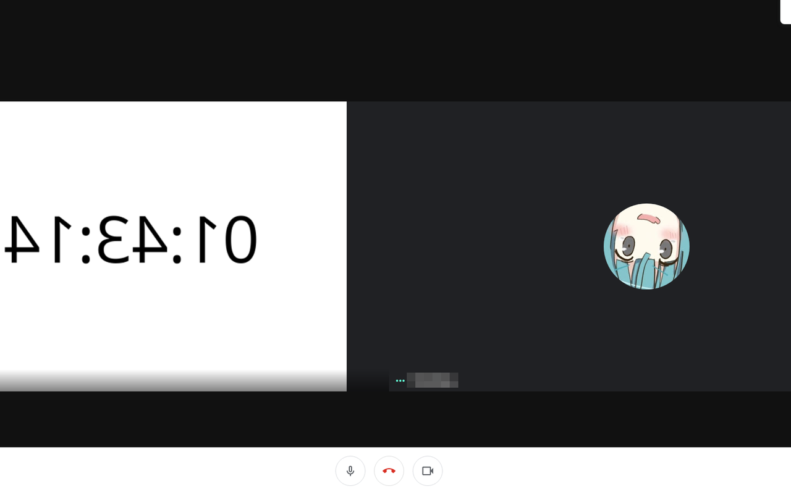

#  Chrome Dummy Camera

Provides a virtual dummy camera for developers. You can replace the original camera image with a dummy image by enabling the extended functionality.

The following dummy video outputs are supported
- digital clock

This is the alpha version. Replaces `MediaDevices.getUserMedia()` with HTML5's Canvas animation and turns the camera input into a digital clock.
If navigator.mediaDevices.getUserMedia() is working, there is no need to prepare a physical camera. On the other hand, services such as Google Meet need to recognize the camera module to work.

開発者向けの仮想ダミーカメラを提供します．
拡張機能を有効にすると，本来のカメラ映像をダミー映像に置き換えることができます．

次のダミー映像の出力に対応しています：
- デジタル時計

アルファ版です．`MediaDevices.getUserMedia()`をHTML5のCanvasアニメーションに置き換えて，カメラ入力をデジタル時計にします．
navigator.mediaDevices.getUserMedia() が動作する環境であれば，物理カメラを持っていなくてもダミーカメラ出力が可能です．一方で，Google Meetのようなサービスでは，カメラモジュールが読み込まれないと機能しません．


## Install

Download `chrome-dummy-camera.crx` from the release page.
Open Chrome's extensions page and enable developer mode. Drag and drop the crx file to install it.

リリースページから`chrome-dummy-camera.crx`をダウンロードします．
Chromeの拡張機能ページを開き，デベロッパーモードを有効にします．ドラッグアンドドロップで，crxファイルをインストールします．

## Build

If you want to use the latest version, you can use npm or yarn to build it.
The output is placed under the `build` directory.

コミット最新版を使いたい場合は，npmもしくはyarnを使ってビルドします．
`build`ディレクトリ下にファイルが出力されます．

````
npm run build # or yarn build
````

## Screenshot



## Contribution

Suggestions and pull requests are welcomed!.

## LICENSE

[MIT](./LICENSE)
